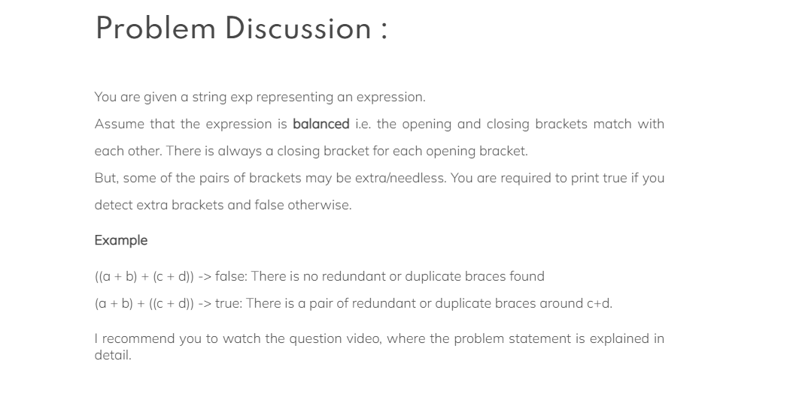

# Duplicate Brackets


## code
```java
 public void duplicateBracket(String str) {
        Stack<Character> st = new Stack<Character>();
        for (int i = 0; i < str.length(); i++) {
            if (str.charAt(i) == ')') {
                if (st.peek() == '(') {
                    System.out.println("true");
                    return;
                } else {
                    while (st.peek() != '(') {
                        st.pop();
                    }
                    st.pop();
                }
            } else {
                st.push(str.charAt(i));
            }
        }
        System.out.println("false");
    }
```
> Complexity :
> - Time Complexity: ***O(n)***
