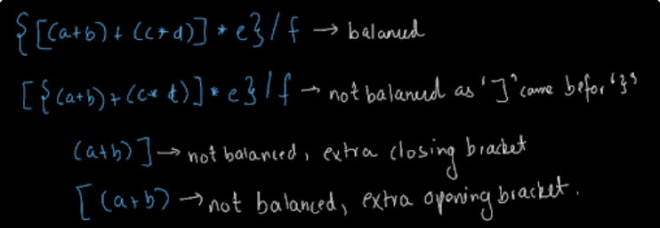

# Matching Brackets

```java
 public boolean matchingBracket(String str){
        Stack<Character> st = new Stack<Character>();
        for (int i = 0; i < str.length(); i++) {
            Character c = str.charAt(i);
            if (isOpening(c)){
                st.push(c);
            }else {
                if(st.isEmpty()){
                    return false;
                }else if(!isMatching(st.peek(),c)){
                    return false;
                }else{
                    st.pop();
                }
            }
        }
        return st.isEmpty();
    }
```

