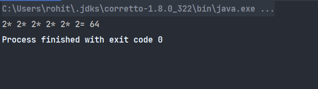

# Prime Factorization
```java
public class PrimeFactorization{
    public int solution(int n){
        int result = 1;
        int i=2;
        while(n > 1){
            if(n % i != 0){
                i++;
            }else {
                System.out.print(i);
                result *=i;
                n=n/i;
            if(n>1) System.out.print( "* ");
            }
        }
        return result;
    }

    public static void main(String[] args) {
        PrimeFactorization pr = new PrimeFactorization();
        System.out.print("= "+pr.solution(64));
    }
}
```

## output:

