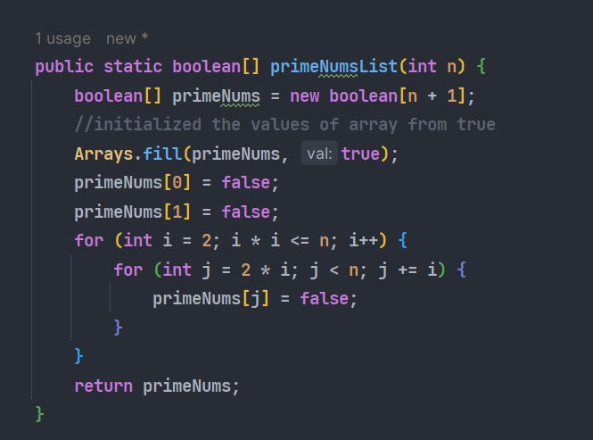

# Seive Eratosthenes 
### Steps:
> - Take Array of Boolean Type
> - full the array with `true` value (Initially considered all value as prime number)
> - take outer-loop which start from 2 and jump their multiples along with assign the value from `false`
> - increase the value of outer loop as so on
> - inner loop will be executed only $\sqrt{n}$ times (i*i = n => i = $\sqrt{n}$)
> - Repeat step 2 to 6 until value of n 

*Note* : Given example value is taken 12. That's why     

> Required number of Steps for inner loop 
> $\sqrt{12}$ = 2 $\sqrt{3}$  where $\sqrt{3}$ = 1.73205080757   
> = 3.46410161514 
> =~ 3

