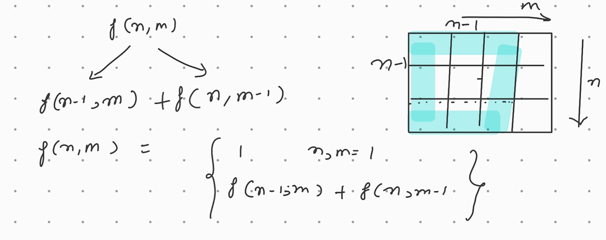

# Find the number of ways for n * m matrix?


``` java
  public static int countPath(int m,int n){
        if(n==1||m==1)
        return 1;
        return countPath(m-1,n)+countPath(m,n-1);
        }
```
